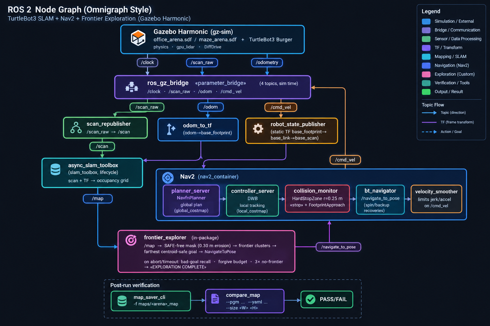

# TurtleBot3 2D LiDAR-Based Autonomous Navigation & Path Finding with SLAM

**ROS 2 Jazzy + Gazebo Harmonic (gz-sim 8) · no `gazebo_ros_pkgs`**
A complete, arena-swappable autonomous mapping stack for a TurtleBot3 Burger
with a 2D LDS-02 LiDAR: **SLAM → frontier exploration → Nav2 path finding →
collision-safe navigation** — plus ground-truth verification of every map it
builds.

```
   SLAM (slam_toolbox) ─► /map ─► frontier_explorer ─► NavigateToPose goals
        ▲     │                      │           └──► Nav2 (planner + controller)
        │     ▼                      ▼                        │
   scan + TF       occupancy grid + costmaps       cmd_vel ───► gz-sim (robot)
```

---

## 📺 Video Demo

**YouTube:** https://www.youtube.com/watch?v=RiFVC3jF5-8

---

## ✨ Features

- **Fully autonomous exploration** — in-package greedy frontier explorer
  (`frontier_explorer.py`) reads the live occupancy grid, picks the *farthest
  safe* frontier cluster (centroid-preferred), and drives there via Nav2. No
  route tables, works in any arena.
- **Arena-swappable** — swap `world_file:=` and the same stack maps it. Proven
  in a furnished 4×8 m office **and** a 5×5 m maze (0.85 m corridors).
- **SLAM without extra map plumbing** — `slam_toolbox` async SLAM publishes
  `/map`; Nav2 costmaps are *subscribers* to it, so mapping and navigation run
  concurrently with no map-exchange handoff.
- **Path finding & obstacle avoidance with Nav2** — NavfnPlanner (global),
  DWB controller (local), static/obstacle costmaps, plus a
  **collision_monitor `HardStopZone`** that hard-stops the robot when anything
  enters a 0.25 m circle ahead (and a `FootprintApproach` slow-down zone).
- **Gazebo Harmonic without Classic plugins** — everything rides on
  `ros_gz_bridge`; odometry→TF and LiDAR re-framing are ROS-side nodes
  (`odom_to_tf.py`, `scan_republisher.py`) because gz-sim has no ROS `/tf`.
- **Robustness under sim artifacts** — per-goal timeout + bad-goal recall
  (0.35 m), sealed-pocket forgive budget (6 retries), safe-clearance erosion so
  goals never land in Nav2's lethal wall band, and an idle `DONE` phase after
  exploration.
- **Ground-truth verification** — `compare_map` decodes a saved `.pgm/.yaml`
  and asserts the arena extent (±0.2 m) → **PASS/FAIL exit code**.
- **Two pipelines in one package** — v1 (manual 26-leg closed-loop route,
  office-only, untouched) and v2 (autonomous Nav2 exploration, arena-generic).
- **Headless-friendly** — server-only gz-sim, RViz optional.

---

## 📁 Files & their purpose

| File | Purpose |
|------|---------|
| `src/tb3_office_sim/launch/autonomous_mapping.launch.py` | **v2 one-shot launch**: gz-sim + robot spawn → bridge → SLAM → Nav2 → explorer (arena-agnostic, SDF world-name parsed) |
| `src/tb3_office_sim/tb3_office_sim/frontier_explorer.py` | Autonomous exploration node (frontier detection, goal selection, timeout/recovery logic) |
| `src/tb3_office_sim/config/nav2/nav2_params.yaml` | Nav2 tuning: costmaps, planner/controller, collision_monitor HardStopZone 0.25 m |
| `src/tb3_office_sim/config/mapper_params_online_async.yaml` | slam_toolbox tuning for the LDS-02 lidar |
| `src/tb3_office_sim/worlds/office_arena.sdf` | 4×8 m furnished office world (desks, shelf, table, cabinet, chairs) |
| `src/tb3_office_sim/worlds/maze_arena.sdf` | 5×5 m maze world (interior walls, ~0.85 m corridors) |
| `src/tb3_office_sim/tb3_office_sim/compare_map.py` | Verifies a saved map against the arena's ground-truth dimensions |
| `src/tb3_office_sim/tb3_office_sim/scan_republisher.py` | Re-frames the gz lidar scan into `base_scan` for SLAM |
| `src/tb3_office_sim/tb3_office_sim/odom_to_tf.py` | Publishes `odom → base_footprint` TF from `/odom` (no sim-side TF) |
| `src/tb3_office_sim/launch/office_world.launch.py` | **v1** world+spawn+bridge launch (untouched) |
| `src/tb3_office_sim/launch/slam_mapping.launch.py` | **v1** SLAM lifecycle launch (untouched) |
| `src/tb3_office_sim/tb3_office_sim/drive_route.py` | **v1** closed-loop 26-leg route driver (untouched) |
| `src/tb3_office_sim/maps/maze_map.{pgm,yaml}` | Verified 5×5 m maze map (101×101 @ 0.05 m) |
| `src/tb3_office_sim/maps/office_map.{pgm,yaml}` | Verified 4×8 m office map (81×160 @ 0.05 m) |
| `src/tb3_office_sim/VERIFICATION_v2.md` | Full v2 verification report (log evidence, checklists) |

---

## 🔀 ROS 2 Node workflow



---

## ✅ Results (verified reference runs, 2026-09-16)

### Maze arena — 5×5 m
| Phase | Result |
|-------|--------|
| Exploration | 8 goals · 19.59 m² mapped (**78.4 %** of 25 m²) |
| Termination | `EXPLORATION COMPLETE - no frontiers remaining` |
| Map verification | `compare_map --size 5 5` → **PASS** (measured 4.95×5.00 m, Δ 0.05 m ≤ ±0.2 m) |
| Goal-nav demo (maze solving) | `NavigateToPose` (0.26,−1.08) → (1.80, 1.80) → **SUCCEEDED** in ~29 s |
| Collision-monitor stops | **0** (entire run incl. demo) |
| Saved map | `maps/maze_map.{pgm,yaml}` — 101×101 px @ 0.05 m |

### Office arena — 4×8 m
| Phase | Result |
|-------|--------|
| Exploration | 9 goals · 19.42 m² mapped (60.7 % of 32 m²) |
| Termination | `EXPLORATION COMPLETE - no frontiers remaining` |
| Map verification | `compare_map --size 4 8` → **PASS** (measured 4.00×7.95 m, Δ 0.05 m) |
| Collision-monitor stops | **0** during exploration |
| Saved map | `maps/office_map.{pgm,yaml}` — 81×160 px @ 0.05 m |

**Pipeline hardening:** earlier desk/table runs wedged the robot (a Gazebo
contact-pin physics artifact: frozen odom, spin-only recoveries). v2 ships a
conservative `robot_radius 0.15` / `inflation_radius 0.35` footprint so the
0.85 m maze corridors are fully navigable.

---

## 🚀 Quick start

```bash
# Ubuntu 24.04 + ROS 2 Jazzy + Gazebo Harmonic
sudo apt install ros-jazzy-ros-gz ros-jazzy-slam-toolbox ros-jazzy-nav2 \
  ros-jazzy-nav2-map-server ros-jazzy-robot-state-publisher ros-jazzy-rviz2

mkdir -p ~/tb3_nav_ws/src && cd ~/tb3_nav_ws
ln -s <clone>/src/tb3_office_sim src/tb3_office_sim   # or copy
colcon build --symlink-install && source install/setup.bash
export TURTLEBOT3_MODEL=burger

# v2 — autonomous mapping, maze (headless)
ros2 launch tb3_office_sim autonomous_mapping.launch.py \
  world_file:=maze_arena.sdf arena_size:="5 5" headless:=true

# v2 — office arena
ros2 launch tb3_office_sim autonomous_mapping.launch.py \
  world_file:=office_arena.sdf arena_size:="4 8" headless:=true

# save + verify while the stack is up
ros2 run nav2_map_server map_saver_cli -f maps/maze_map \
  --ros-args -p map_subscribe_transient_local:=true
ros2 run tb3_office_sim compare_map --pgm maps/maze_map.pgm \
  --yaml maps/maze_map.yaml --size 5 5
```
Full details: the package-internal `README.md` covers the v1/v2 split, the
map-save quirk, and the reference numbers.

---

## 📜 License

Apache-2.0 — see `LICENSE`.
